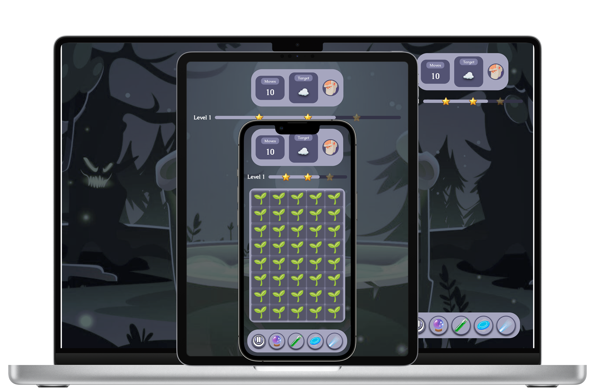

# Grimoji


 A gothic alchemy game for mixing and collecting emojis.
 


<div align="center">
 Available on
</div>

<div align="center">

[](https://play.google.com/store/apps/details?id=io.grimoji.game)
[](https://apps.microsoft.com/detail/9PFZ6M6XMQ2P)
[](https://flathub.org/apps/io.grimoji.game)
[](https://snapcraft.io/grimoji)

</div>

## Setup

### Env Var

[See the example file](.env.example)

> Copy that fil and rename it to `.env` 

> Then enter your own values

### [Install Flutter](https://docs.flutter.dev/install)

```bash
flutter doctor
```

### Install Dependencies

```bash
flutter pub get
```

### Sanity Check

```bash
flutter analyze
```

### Run Tests

```bash
flutter test
```


## Logging


```dart
import 'package:logging/logging.dart';

final _log = Logger('Foo');

void foo() {
  _log.info('Hello, world!');
}
```

This will show up in the console as:

```text
[Foo] Hello, world!
```

When using Flutter DevTools, all the metadata of the log message is preserved, 
so you can filter by logger name, log level, and so on.

## How To Run Locally

### Web


```bash
flutter run -d chrome
```

> Images DOn't Load try: `flutter run -d chrome --web-browser-flag="--ignore-gpu-blocklist" --web-browser-flag="--enable-webgl"`

### Android

```bash
flutter run -d android
```

### iOS

```bash
flutter run -d ios
```

### Windows

```bash
flutter run -d windows
```

### Linux

```bash
flutter run -d linux
```

### macOS

```bash
flutter run -d macos
```

## How to build locally

### Android

```bash
flutter build apk --release
```

### iOS

```bash
flutter build ipa --release
```

### Windows

```bash
flutter build windows --release
```

### Linux

```bash
flutter build linux --release
```

```bash
chmod +x ./tools/build_deb.sh
```

```bash
./tools/build_deb.sh
```

```bash
sudo dpkg -i grimoji-local.deb
```
### macOS

```bash
flutter build macos
```

### Flatpak

Build a Flatpak package locally:

```bash
flatpak install -y flathub org.flatpak.Builder
flatpak run --command=flatpak-builder org.flatpak.Builder --install . io.grimoji.game.yml
```

Or build without installing:

```bash
flatpak-builder --force-clean build-dir io.grimoji.game.yml
flatpak-builder --export=repo build-dir io.grimoji.game.yml
flatpak build-bundle repo grimoji.flatpak io.grimoji.game
```


## How to Deploy

### Commit and Push To Main

```bash
git push origin main
```

### Setup Script

```bash
chmod +X ./tool/deploy.sh
```

### To Release

```bash
./tool/deploy.sh v0.0.1
```

### To Update A Release

```bash
./tool/deploy.sh v0.0.1 --replace
```

## Credits

- [Animated Emoji 💖](https://googlefonts.github.io/noto-emoji-animation/) for the emoji animations and SVG icons

- [Pixabay](https://pixabay.com/) for the sfx

- [Gemini](https://gemini.google.com/) for the music

- [Vecteezy](https://vecteezy.com/) for the background and pattern images
